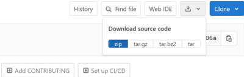
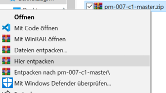
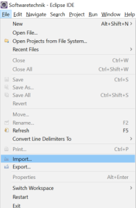
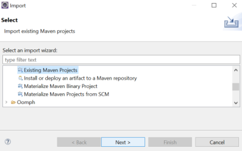
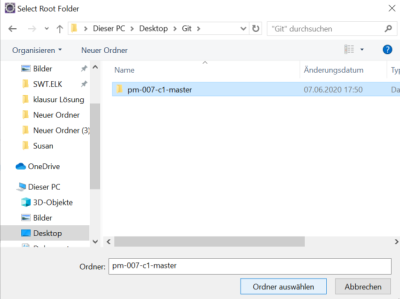
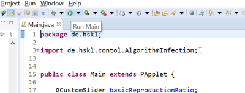

# PM007

## Simulator
Dies ist eine Simulation zur Visualisierung der Verteilung der Coronapandemie

- Nach Auswahl der Gesamtanzahl der Personen, Reproduktionszahl R0 und der Anzahl der infizierte am Anfang, kann das Programm gestartet werden
- Während der Simulation wird die Anzahl gesunder, infizierter, geheilter und toter Menschen angezeigt
- bei direktem Kontakt mit einer infizierten Person mit einem Abstand von unter 1,5 Meter könnte eine Person infiziert werden
- Eine infizierte Person gilt in der Simulation nach 8 Tagen als geheilt!

## Lizenzbedingungen

Copyright (c) [2020] [PM007]

Permission is hereby granted, free of charge, to any person obtaining a copy
of this software and associated documentation files (the "Software"), to deal
in the Software without restriction, including without limitation the rights
to use, copy, modify, merge, publish, distribute, sublicense, and/or sell
copies of the Software, and to permit persons to whom the Software is
furnished to do so, subject to the following conditions:

The above copyright notice and this permission notice shall be included in all
copies or substantial portions of the Software.

THE SOFTWARE IS PROVIDED "AS IS", WITHOUT WARRANTY OF ANY KIND, EXPRESS OR
IMPLIED, INCLUDING BUT NOT LIMITED TO THE WARRANTIES OF MERCHANTABILITY,
FITNESS FOR A PARTICULAR PURPOSE AND NONINFRINGEMENT. IN NO EVENT SHALL THE
AUTHORS OR COPYRIGHT HOLDERS BE LIABLE FOR ANY CLAIM, DAMAGES OR OTHER
LIABILITY, WHETHER IN AN ACTION OF CONTRACT, TORT OR OTHERWISE, ARISING FROM,
OUT OF OR IN CONNECTION WITH THE SOFTWARE OR THE USE OR OTHER DEALINGS IN THE
SOFTWARE.

## Ausführen eine Java Datei
Zum Ausführen einer Java Datei benötigst du das *Java Runtime Environment*, dieses kannst du zum Beispiel direkt auf der JAVA Homepage herunterladen.
[Link zur Downloadseite von Java](https://www.java.com/de/download/).

Nachdem die Installation beendet ist kannst du im Ordner "executable" eine Datei finden mit dem Namen "PM007-Corona-Simulation.jar". Diese Datei wird mit einem Doppelklick geöffnet.

## Installationsanweisung um ein Mavenprojekt zu starten
Hier wird exemplarisch ein Mavenprojekt in dem Editor *Eclipse* geöffnet. Das Vorgehen kann in anderen Editoren etwas unterschiedlich sein.

**1. Source Code als ZIP-Datei herunterladen**

 

**2. ZIP-Datei entpacken**

**3. Auf Eclipse *File --> Import* anwählen**

**4. Wählen Sie *Existing Maven Projects***

**5. Den entpackten Ordner im Menü auswählen**

**6. *Run Main* in Eclipse auswählen**

